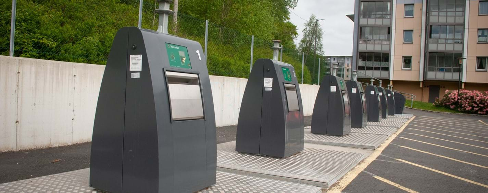

# Recycling and Garbage Disposal

## Sorting

In Rogaland, there's two different types of garbage;

- Biodegradable: goes in a grey-ish corn-based bag
- The rest: goes in a normal shopping bag

## Throwing

A little ways from the house, there are containers for the garbage that are submerged underground. They look like this:

To use them, you need a nfc chip. Any nfc chip will do, which means that you can use your card, your phone, the chip for
the house or any other chip you are in possession of.

To throw garbage, first find the correct type of container for the waste you are disposing of, push the hand symbol and
then hold the chip over the chip symbol.
You should hear the lock open, and now you can open the lid of the container. Close it when you are done.